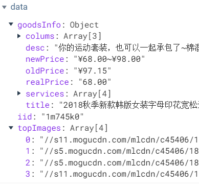

# shoppingwebsite_vue

## Project setup
```
npm install
```

### Compiles and hot-reloads for development
```
npm run serve
```

### Compiles and minifies for production
```
npm run build
```

### Run your tests
```
npm run test
```

# 初始工作

### 划分目录结构

### 引用css文件

+ base.css
+ normalize.css

### 配置文件

#### vue.config.js

+ 配置路径

```
module.exports = {
  configureWebpack: {
    resolve: {
      extensions: [
        '.js','.vue','.json','.css','.scss'
      ],
      alias: {
        'assets': '@/assets',
        'common': '@/common',
        'components': '@/components',
        'network': '@/network',
      }
    }
  }
}
```

#### .editorconfig

### 引入tabbar模块

### 配置路由映射

### 更改favicon图标

在index页面中：

``link rel="icon" href="<%= BASE_URL %>favicon.ico"``，<%= BASE_URL %>为jsp语法，获取当前文件所在路径

# 首页开发

## navigation bar组件

+ NavBar.vue 封装

  ```
  export default {
    name: 'NavBar'
  }
  ```

+ 使用

  ```
  <nav-bar class="home-nav"><div slot="center">购物街</div></nav-bar>
  import NavBar from...
  	...
  export default {
  	...
  	components: {
      NavBar,
    	...
    },	
  }
  ```

## 首页数据请求

+ 封装request.js
+ home.js负责首页数据请求

+ Home.vue中请求数据

  ```
  data() {
  	// 保存res
      return {                          
        // result: null
        banners: [],
        recommends: []
      }
    },
  created() {                
      // 请求多个数据
      getHomeMultidata().then(res => {
        console.log(res)
        // this.result = res
        this.banners = res.data.banner.list
        this.recommends = res.data.recommend.list
      })
    }
  ```

## 首页轮播图

+ Home.vue -> HomeSwiper.vue组件树

+ HomeSwiper.vue 中，将banners数据通过props从home.vue传过来

+ v-for循环遍历展示

  ```
  <swiper-item v-for="(item, index) in banners" :key="index">
          <a :href="item.link">
            
          </a>
       </swiper-item>
  ```


## recommend

+ RecommendView.vue 中，将recommends数据通过props从home.vue传过来
+ v-for循环遍历展示

## tabcontrol组件封装

+ 项目内重复使用，放入components -> content 内
+ 不同页面仅文字不同，无需使用插槽
+ 使用组件通过props将titles传过来

+ div>根据titles 遍历 div -> span{{title}}
+ 绑定tab点击事件
  + 定义currentIndex保存index

## 首页商品数据请求

#### 保存数据的变量

+ 流行 - 'pop'
+ 新款 - 'new'
+ 精选 - 'sell'
+ 数据结构

```
goods: {
	'pop': {page: 记录数据库页数, list: [记录数据]},
	'new': {page: 1, list: [...]},
	'sell': {page: 1, list: [...]}
}
```

+ 在home.js中封装getHomeTabData(type, page)
+ 组件一经创建 created() 分别调
  + this.getHomeTabData('pop')
  + this.getHomeTabData('new')
  + this.getHomeTabData('sell')
+ 在Home.vue中, 在methods中getHomeTabData(type)
+ 获取到数据
  + this.goods[type].list.push(...res.data.list)
  +  this.goods[type].page += 1

#### 监听tab点击，分别进行展示

+ 记录index，首页根据index发送对应数据

  + 子传父 this.$emit('itemClick', index)

  + 首页接收

    + 定义变量currentType记录type
    + \<goods-list :goods="goods[currentType].list"\</goods-list>
  + swith(index) {case 0: this.currentType = 'pop' break case1: ...}
  
+ GoodsList.vue中，通过props接收首页数据

  + goods: {

    ​	type:Array,

    ​	default() {

    ​		return []

    ​	}

    }

  + v-for="(item,index) in goods

+ GoodsListItem.vue 中，取出数据，通过div/span/img标签进行展示

## 对滚动进行重构 

### Better-Scroll

+ 解决移动端、PC各种滚动场景需求的插件

+ [官方文档](https://better-scroll.github.io/docs/zh-CN/guide/#betterscroll-%E6%98%AF%E4%BB%80%E4%B9%88)

+ npm install @better-scroll/core  --save

### 在index.html中使用better-scroll

+ 导入core.js 库
+ const  bscroll = new BScroll(document.querySelector('.wrapper'), { options})

+ better-scroll 监听滚动

  + 默认情况下，BScroll无法实时监听，需要传入参数

  + probeType: 0/1/2(监听手指滚动)/3(监听所有滚动)

  + bscroll.on('scroll',(position) => {

       console.log(position)

      })

+ better-scroll 上拉加载

### 在vue中使用better-scroll

+ npm install --save better -scroll -S @better-scroll/pull-up
+ 使用

```
import BScroll from 'better-scroll'
import Pullup from '@better-scroll/pull-up'
BScroll.use(Pullup)

data() {
return {
	scroll: null
}
}

mouted() {
	this.scroll = new BScroll('.wrapper',{
      probeType: 3,
      pullUpLoad: true,
    })
    // this.scroll.on('scroll',(position) => {
    //   console.log(position)
    // })
    this.scroll.on('pullingUp', () => {
      console.log('上拉加载')
    })
}
```

+ 对better-scroll进行封装

  + Scroll.vue  

    ```
    <template>
      <div class="wrapper" ref="wrapper">   // 通过ref定位元素：new BScroll(this.$refs.wrapper,{...})
        <div class="content">
        <slot></slot>
        </div>
      </div>
    </template>
    
    setTimeout(() => {this.scroll = new BScroll(this.$refs.wrapper, {
          observerDOM: true,
          click: true,
          probeType: 3
        })
        }, 1000);
      },
    ```
  
  + Home.vue
  
    ```
    <template>
    	 <div id="home" class="wrapper">
    	 	...
    	 	<scroll class="content">
    	 		...
    	 	</scroll> 
    	 </div>
    </template>
    
    <style scoped>
    	.content {
     		 height:...;
     	 	overflow: hidden;
    	}
    </style>
    ```

### 回到顶部BackTop

+ 封装BackTop.vue组件

+ 监听组件点击，注意监听组件需加修饰符.native
  + <back-top @click.native="backTopClick">\</back-top>
  + scroll中提供回到顶部方法
    + scroll对象, scroll.scrollTo(x, y, time)
    + 通过refs拿到子组件的对象
      + this.$refs.scroll.scrollTo(0, 0)
  
+ 显示和隐藏

  + 组件内监听滚动，通过$emit传出去

    + this.scroll.on('scroll', (position) => {

      ​	this.$emit('scroll', position)

      })

  + 首页通过@scroll自定义事件接收

    + @scroll="contentScroll"
    + showBackTop = false

    + contentScroll(position) {

         if(position.y < -666) {

      ​    this.showBackTop = true

         }else {

      ​    this.showBackTop = false

         }

        }

### 上拉加载更多功能

+ 在Scroll.vue 中监听上拉

  + import PullUp from '@better-scroll/pull-up'

  + BScroll.use(PullUp)

  + this.scroll.on('pullingUp', () => {

    ​	this.$emit('pullingUp')

    })

  + props: {

    ​	...

    ​	pullUpLoad: {

    ​		type: Boolean,

    ​		default: false

    ​	}

    }

+ Home中加载更多数据

  + :pullingLoad= "true"

  + @pullingUp = "loadMore"

  + loadMore() {

    ​	this.getHomeTabData(this.currentType)

    ​    this.$refs.scroll.scroll.refresh()  // better—scroll重新计算高度

    }

  + 数据请求完成后 this.$refs.scroll.scroll.finishPullUp()

### 解决首页中可滚动区域的问题

+ Better-Scroll在决定有多少区域可以滚动时, 是根据scrollerHeight属性决定
  - scrollerHeight属性是根据放Better-Scroll的content中的子组件的高度
  - 但是我们的首页中, 刚开始在计算scrollerHeight属性时, 是没有将图片计算在内的
  - 所以, 计算出来的告诉是错误的(1300+)
  - 后来图片加载进来之后有了新的高度, 但是scrollerHeight属性并没有进行更新.
  - 所以滚动出现了问题

+ 如何解决该问题？

  + 监听每一张图片是否加载完成, 只要有一张图片加载完成了, 执行一次refresh()
  + 如何监听图片加载是否完成?
    + 原生的js监听图片: img.onload = function() {}
    + Vue中监听: @load='方法'

  + 调用scroll的refresh()

+ 在GoodsItemList.vue 中监听，在主页调Scroll.vue 中的refresh()方法

  + 涉及到非父子组件的通信，选择**事件总线**
  + 基本方法
    + Vue.prototype.$bus = new Vue()
    + this.bus.emit('事件名称', 参数)
    + this.bus.on('事件名称', 回调函数(参数))

+ 对于refresh非常频繁的问题, 进行防抖操作

  + 防抖函数起作用的过程:
    + 如果我们直接执行refresh, 那么refresh函数会被执行30次
    + 可以将refresh函数传入到debounce函数中, 生成一个新的函数
    + 之后在调用非常频繁的时候, 就使用新生成的函数
    + 而新生成的函数, 并不会非常频繁的调用, 如果下一次执行来的非常快, 那么会将上一次取消掉(cleartimeout)

  + 基本使用

  ```javascript
  debounce(func, delay) {
  	let timer = null
      return function(...args) {
          if(timer) clearTimeout
          timer = setTimeout(() => {
              func.apply(this, args)
          }, delay)
      }
  },
  ```

### better-scroll中解决吸顶问题

#### 获取tabControl的offsetTop

+ 定义变量tabOffsetTop 来保存距离值，定义isTabFixed: false 记录

+ 图片加载需要时间，使用定时器

  ```javascript
  setTimeout(() => {
        this.tabOffsetTop = this.$refs.tabControl.$el.offsetTop               
      }, 1000); 
  ```

+ 在滚动监听中 this.isTabFixed = (-position.y) > this.tabOffsetTop

+ 多复制了一份TabControl组件对象, 利用它来实现停留效果 v-show="isTabFixed"

+ 注意同时维护两个TabControl组件对象的点击事件

  + $refs.tabControlFack和$refs.tabControl

  + 在itemClick点击中 

    ```
    this.$refs.tabControlFack.currentIndex = index
    this.$refs.tabControl.currentIndex = index
    ```


### Home记录离开时的状态和位置

+ \<keep-alive>

     \<router-view>\</router-view>

   \</keep-alive>\ 

# 详情页开发

### 点击GoodListsItem跳转详情页同时携带id

+ 创建views/detail组件

+ 配置路由

+ 监听GoodListItem点击

  ```
  itemClick() {
  	this.$router.push('/detail/'+ this.goodsItem.iid)
  }
  ```

### 详情页导航栏的封装

+ 结构

  ```
  --|views
  	--|detail
  		--|childComponents
  			--|DetailNavBar.vue
  		--|Detail.vue	
  ```

+ 插槽左边放返回图标， 右边遍历四个标题

+ 请求详情页数据

  + network/detail.js封装详情页数据， 带iiid参数，iid在GoodsItem点击时获取

  + Detail.vue 中请求数据

    + import {getDetail} from '../../network/detail'

    + data() {return {topImages: []}} 

    + 根据iid请求详情数据

      ```javascript
      getDetail(this.iid).then(res => {
            console.log(res)
            this.topImages = res.result.itemInfo.topImages
          })
      ```

  + 在DetailSwiper.vue中展示数据

    + 遍历
    + 解除Detail路由的keep-alive \<keep-alive exclude="Detail">

### 详情商品基本信息展示GoodsBaseInfo

+ 服务器的数据杂乱，设计好数据结构对象保存需用到的数据

  + 在detail.js中，将服务器返回数据封装在一个类中

  ```javascript
  export class GoodsInfo {            // es6语法
      // 通过构造器定义变量来存储数据
      constructor(itemInfo, columns, services) {
          this.title = itemInfo.title,
          this.desc = itemInfo.desc,
          this.newPrice = itemInfo.price,
      	this.oldPrice = itemInfo.oldPrice,
          this.discount = itemInfo.discountDesc,
      	this.columns = columns,
      	this.services = services,
      	this.realPrice = itemInfo.lowNowPrice    
      }
  }
  ```
  
  + 在Detail.vue中创建类对象保存数据
  
  ```javascript
  data() {
      return: {
          ...
          goodsInfo: null
      }
  }
  
  created() {
      ...
      getDetail(this.iid).then(res => {
          ...
          this.goodsInfo = new GoodsInfo(res.result.itemInfo, res.result.columns,res.result.shopInfo.services)
      })
  }
  ```
  
  + 最终数据结构如下：
  
  

+ 封装childCompnents/GoodsBaseInfo.vue并从Detail.vue拿到数据
+ 通过各种标签展示数据

### 引入better-scroll

+ 隐藏TabBar（有待解决 v-show 处理路由渲染？ v-show: $route.meta.TabBar）

+ 注意CSS样式

### 商家信息

+ Detail.vue 中获取数据
+ DetailShopInfo.vue 中展示

### 商品信息

+ 同上
+ v-for 循环遍历二维数组

### 用户评价

+ 时间戳转格式化日期

  ```javascript
  // 时间戳转成Date对象
  const date = new Date(~*1000)
  // 格式化，转换成对应的字符串
  formate(date, 'yyyy-MM-dd')
  ```

### 商品推荐

+ 直接使用组件GoodList
+ 注意更改图片  

### 内容和tab标题的联动效果

+ 点击tab标题，跳到对应内容

  + tab组件内记录点击index，发送给Detail首页

  + componentTopY: null

  + titleClick(index) {

    ​	this.$ref.scroll.scrollTo(0, -this.componentTopYs[index], 100)

    }

  + 监听推荐信息图片加载，等加载完后再计算高度

  ```
  // 在DetailImageInfo里监听加载,发送给首页
  @load="detailImageLoad
  detailImageLoad() {
        this.$emit('detailImageLoad')
      }
  // Detail中
  detailImageLoad() {
  	this.$refs.scroll.scroll.refresh()
  	this.componentTopYs = []
  	this.componentTopYs.push(0)
  	this.componentTopYs.push(this.$refs.param.$el.offsetTop)
  	...
  }
  
  ```

+ 拖动内容，tab对应的标题变为红色

  + scroll内监听滚动位置, 事件传到detail, @scroll=“contentScroll"
  
  + contentScroll(position) {
  
    ​	const positionY = -position.y
  
    ​	if(positionY >= 0 && positionY < this.componentTopYs[1])){
  
    ​		this.scrollIndex = 0
  
    ​		this.$refs.nav.currentIndex = this.scrollIndex
  
    ​	} else if(...){...}
  
    }

### BackTop组件

+ mixin 的使用

### 底部工具栏

+ 注册使用

+ 点击加入购物车

  + 获取购物车所需信息

    + const product = {}

    + product.iid = this.iid

      product.image = this.topImages[0]

      ...

  + this. $store.commit('addCart', product)提交到vuex管理

    ```javascript
    state: {
        cartList: []
      },
    mutations: {
        addCart(state, payload) {
            ...
            state.cartList.push(payload)
        }
    } 
    ```

  #### 重构vuex代码

+ 涉及知识 Actions 和 mutations

  + mutations
    + Mutation唯一用于变更store state中的数据
    + 不可以直接操作store中的数据
  + Actions
    + Action 提交的是 mutation，而不是直接变更状态
    + Action用于处理异步任务

+ 将两种事件(添加新的商品addtocart和添加同一商品增加数量addcounter)通过actions做判断拆分为两种事件，分别通过context.commit调用mutations里的函数

  ```javascript
  // actions
  addCart(context, payload) {
      let sameProduct = null
      for (let item of context.state.cartList) {
        if (item.iid === payload.iid) {
          sameProduct = item
        }
      }
      if (sameProduct) {
        context.commit(ADD_COUNTER, sameProduct)
      } else {
        payload.checked = true
        payload.count = 1
        context.commit(ADD_TO_CART, payload)
      }
  // mutations
  [ADD_COUNTER](state, payload) {
      payload.count++
   },
    [ADD_TO_CART](state, payload) {
      state.cartList.push(payload)
    }
  ```

  

### “您已添加至购物车”

+ Toast

# 购物车页面开发

### 购物车NavBar的实现

+ 导入common->NavBar

+ 从getter.js中获取cartLength

  ```
  export default {
    cartLength(state) {
      return state.cartList.length
    }
  }
  ```

+ vuex内置的辅助函数：当一个组件需要获取多个状态时候，将这些状态都声明为计算属性会有些重复和冗余

  + mapGetters

  + 导入mapGetters -》 import { mapGetters } from 'vuex'

  + 使用 

    computed: {

    ...mapGetters['cartLength', '...', '...']

    }

+ 引入Better-scroll

  + \#cart {

      height: 100vh

    }

  + 给scroll设置高度 class="content" .content  {height: calc(100% - 44px - 49px);

    overflow: hidden;

    }

+ 解决better-scroll滚动问题

  ```
  activated() {
  	// 在vue对象存活的情况下，切换页面触发，即可反复触发
      this.$refs.scroll.scroll.refresh()
    }
  ```

### 购物车商品列表展示CartList和CartListItem

+ CartList中使用mapGetters获取cartList数据
+ GoodListItem 分别展示CartList中的数据

### 封装勾选按钮checkButton

+ 设置checkButton勾选状态

  + 修改数据不要在页面中直接修改，放入模型中，再根据模型渲染DOM

  + 在checkButton中

    + 添加类 :class="{'selector-active': isChecked}"

    + props: {

        isChecked: {

         type: Boolean,

         default: false

        }

       }	

  + 在mutations中为商品添加Checked属性
    + payload.checked = true
  + 在CartlistItem中，从模型中拿到属性 :isChecked="itemInfo.checked"

+ 监听checkButton的点击

  + 监听组件点击 @click.native="checkClick"

  + checkClick() {

       this.itemInfo.checked = !this.itemInfo.checked

      }

+ 合计选中商品价格

  + totalPrice() {

    ​	this.cartList.filter(item => {

    ​		return item.checked

    ​	}).reduce((sum, item) => {

    ​		return sum + item.price * item.count

    ​	}, 0)

    }

+ 去结账件数（同上）

+ 全选全不选

  + 通过修改CheckButton已经定义好的属性isCheck

  + 在CartBottomBar 中 :is-checked = "isSelectAll"

  + isSelectAll() {

    ​    if(this.cartList.length === 0) return false

    ​    return this.cartList.length === this.checkedLength

       }

+ 点击全选按钮，当全选中状态时，将map中的checked修改为false，反之亦然

  + selectAllClick() {

       if(this.isSelectAll) {

    ​    this.cartList.forEach(item => item.checked = false)

       }else {

    ​    this.cartList.forEach(item => item.checked = true)

       }

      }

